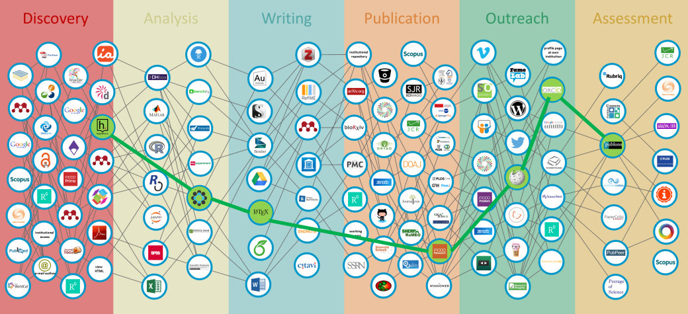

# FAQs {#faq}

## Tools for researchers

A very exhaustive overview of tools used in the researcher`s workflow are 
provided by `r citet(manual["Bosman_2018"])`, which are grouped according to 
different research phases as shown below. 

[](https://101innovations.wordpress.com/workflows/)


## Writing more robust R code

For details on making R code more robust to work on different computers
please read the following [tutorial](file:///Y:/Z-Exchange/_Tutorials/HomeDirectory.html).
<!-- Only adds more details in case of html output as 
defined in "R/add_text.R" -->
`r add_text_links()`

Recommended literature: 

- [Good enough practices in scientific computing](https://doi.org/10.1371/journal.pcbi.1005510) `r citep("10.1371/journal.pcbi.1005510")`
  
- [Ten simple rules for making research software more robust](https://doi.org/10.1371/journal.pcbi.1005412) 
`r citep("10.1371/journal.pcbi.1005412")`

- R programming books (freely available online!)

    + [R for data science](http://r4ds.had.co.nz/) `r citep(manual["Grolemund_2017"])`

    + [Advanced R](http://adv-r.had.co.nz/) `r citep(manual[c("Wickham_2014","Wickham2018")])`
    
    + [R packages](http://r-pkgs.had.co.nz/) `r citep(manual["Wickham_2015"])`

  

## Using Subversion at KWB

For details on how to use Subversion at KWB please read the following [tutorial](file:///Y:/Z-Exchange/_Tutorials/using_subversion.html) 
<!-- Only adds more details in case of html output as 
defined in "R/add_text.R" -->
`r add_text_links()`

## How to install KWB R packages?

For details please read the following [tutorial](file:///Y:/Z-Exchange/_Tutorials/installing_kwb_packages.html) 
<!-- Only adds more details in case of html output as 
defined in "R/add_text.R" -->
`r add_text_links()`


<!-- Only adds chapter firefox local files in case of html output as 
defined in "R/add_text.R" -->
`r add_chapter_firefox_local_files()`


## How to build your own KWB styled R package?

For building your own R package from scratch we developed a helper R package 
[kwb.pkgbuild](https://github.com/kwb-r/kwb.pkgbuild) (available on Github), 
which builds a KWB styled skeleton for your future R package. 

For more details checkout the [tutorial](https://kwb-r.github.io/kwb.pkgbuild/dev/articles/tutorial.html) 
at the package documentation website.

Recommended literature: 

- [R packages](http://r-pkgs.had.co.nz/) `r citep(manual["Wickham_2015"])`

- [Advanced R](http://adv-r.had.co.nz/) `r citep(manual[c("Wickham_2014","Wickham2018")])`


## Working with EXCEL


```{block2, type = 'rmdcaution'} 
Excel often crashes in case: 

- a formula is applied for a whole column (i.e. 1 million rows)

- a lot of data is processed

```

**Solution: data in own spreadsheet file**
 
Hauke`s "best Practices" for EXCEL (unvalidated, to be discussed!)

 
- Trennung zwischen Eingabe, Verarbeitung und Ausgabe zumindest auf 
Tabellenblattebene, d.h. ein Tabellenblattt (oder mehrere) für Eingabe, eines 
(oder mehrere) für Verarbeitung, eines (oder mehrere) für formatierte Ausgabe 
und / oder Diagramme
 
- ggf. Aufteilen auf mehrere Dateien. Das hätte den Nachteil, dass nicht mehr 
alles in einer Datei ist und nicht so leicht übergeben werden kann. In jedem 
Fall müsste eine Namenskonvention getroffen werden, z.B.`<file_name>`_input.xlsx, 
`<file_name>`_calc.xlsx, `<file_name>`_output.xlsx
 
- Verwenden der relativ neuen EXCEL-Features `Als Tabelle` formatieren.

Vorteil: Formeln können auf ganze Tabellenspalten angewendet werden; Spaltennamen 
anstatt Zellbezüge mit (unsprechenden) Buchstaben und Zahlen. z.B. Formel für 
Spalte `Volumen_L`: `= Durchfluss[@[Q_L_s]] * 60 * 5`
 
- Ein Tabellenblatt pro Tabelle
 
- Genau eine Headerzeile pro Tabelle mit eindeutigen Spaltennamen
 
- Ein Tabellenblatt, das die Bedeutung der Spaltennamen erläutert mit Spalten
`Tabellenblatt; Spalte; Bedeutung; Einheit; Formel`
Vorteil: Dieses Tabellenblatt sollte ausreichen, um die wesentlichen Berechnungen 
zu verstehen.

Drawback: needs to be permanently kept up-to-date!
 
- Hilfsspalten mit (dadurch benannten) Zwischenberechnungen anstatt Wiederholung 
von langen Ausdrücken in Formeln


```{block2, type = 'rmdtip'}
A general online workshop on the topic [Data Organisation in Spreadsheets](http://www.datacarpentry.org/spreadsheet-ecology-lesson/)
is provided for free by the [DataCarpentry](https://datacarpentry.org) organisation.

```

***copied from `10_old_german_chapters.Rmd` ***:

Best Practices zum Arbeiten mit Excel:

* z.B. Zellbezüge benennen, dadurch werden Formeln besser lesbar

Ihr werdet es kaum glauben, aber am Anfang meiner Zeit am KWB habe ich noch 
mit Excel gearbeitet. Ich habe auch komplexe Sachen gemacht und auch 
Excel-Makros programmiert. Ein Beweis findet sich in meiner persönlichen
Logdatei:

> Fr, 14.09.07 08:15-19:30 benutzerdefinierte Excelfunktionen zur Modellgüte in 
Personl.xls, Modul1; TW-Kalibrierung Wochentag fertig

Ich würde heute nicht mehr empfehlen, Excel-Makros zu programmieren. Es ist 
umständlich, es gibt keine Bibliotheken und der Quellcode lässt sich nicht
unabhängig von der Exceldatei verwalten, so dass keine ordentliche 
Versionsverwaltung möglich ist. Und wir wollen nicht mehr ohne 
Versionsverwaltung programmieren!

Wenn wir programmieren, dann sollten wir das einheitlich in R tun. R ist frei,
es gibt eine großartige Community und wir haben mittlerweile eine große 
Expertise erlangt.


## Heterogenous software versions on KWB computers

```{block2, type = 'rmdcaution'}
Unterschiedliche Softwareversionen (z.B. R) können dazu führen, dass Skripte 
auf verschiedenen Rechnern nicht das gleiche Verhalten zeigen. 
```

```{block2, type = 'rmdtip'}
Die IT-Abteilung ist in der Lage an bestimmte Nutzergruppen die gleiche Software 
(z.B. RStudio / R / Miktex) auszurollen. Dies sollte in Zukunft konsequent genutzt
werden, indem auf alle Computer an denen potentiell programmiert wird zu dieser 
Nutzergruppe hinzugefügt werden und somit alle die gleichen Softwareversionen 
installiert haben. 
```

## R package/version dependency of R scripts

Lösungsvorschlag:

Es ist eine **Mindestdokumentation** der verwendeten R Version und sämtlicher 
R-Pakete (inklusive ihrer Versionen) zu fordern. Dazu kann in R die Funktion 
`sessionInfo()` genutzt werden. Die Ausgabe dieser Funktion kann entweder in 
eine Metadaten-Textdatei `session_info.txt` geschrieben werden oder im Falle
der Erzeugung von R-Markdown-Dokumenten direkt am Anfang der Analyse im 
`R-Markdown` Dokument ausgegeben werden. 

Das Schreiben der Metadaten-Datei `session_info.txt` sollte standardisert über 
eine Funktion in einem KWB R-Paket (z.B. `kwb.utils`) implementiert werden.

Direktausgabe in R Console / RMarkddown:
```{r}
sessionInfo()
```

Schreiben in standardisierte Metadatei:
```{r eval = FALSE}
sink("session_info.txt")
sessionInfo()
sink()
```

Hierzu ist auch noch ein Tutorial zu erstellen!

```{block2, type = 'rmdnote'}
Komplexere, technische Möglichkeiten zum Paketmanagement werden im gerade vom 
DFG gefördertem Projekt [O2R](http://o2r.info/) in der Entwicklung befindlichen 
[CRAN task view for computational environments and reproducibility](https://github.com/o2r-project/ctv-computational-environments) 
genannt. 

```

```{block2, type = 'rmdtip'}

Mit dem R Paket [packrat](https://rstudio.github.io/packrat/) lässt sich das 
Paketmanagement ggf. verbessern. 
  
```

Als Beispielanwendung dient die Datenanalyse zur Feinstaubbelastung mit 
Sensebox-Daten, die komplett reproduzierbar sind 
(mittels der Plattform [mybinder](https://mybinder.org/)) und ohne Installation 
von Interessierten im Webbrowser ausgeführt werden kann 
([siehe hier](http://o2r.info/2018/01/12/sensebox-binder/)).


## Complex R script dependencies

```{block2, type = 'rmdcaution'}
Dieses Problem tritt insbesondere auf, wenn mehrere verschiedene Nutzer 
gemeinsam mit den gleichen Skripten arbeiten (wie z.B. im abgeschlossenen 
Projekt OGRE).
```

```{block2, type = 'rmdtip'}
Proposed solution:

Bewusstmachen der Skriptabhängigkeiten

Identifizieren von Optimierungspotentialen -> möglicherweise 
Elimination von Abhängigkeiten

Workflow dokumentieren und Tutorial, am besten als R-Markdown Dokument,
erstellen. Das ist insbesondere wichtig, wenn Skripte häufig verwendet werden.
```


## Heterogenous (R-)coding styles


```{block2, type = 'rmdcaution'}

Currently there is no established coding style at KWB for in case of programming 
e.g. R scripts
```


(R) programmers at KWB will use the tidyverse coding style 
[http://style.tidyverse.org](http://style.tidyverse.org) as default. 
This will help increasing both, the readability and reusability of 
the developed (R-)scripts at KWB (currently: approximately 1000 Rscripts).


Recommended literature:

Clean code `r citep(manual["martin2009"])`

## Collaborative version control 

```{block2, type = 'rmdcaution'}
Multiple people developing code together.
```


```{block2, type = 'rmdtip'}
1. At KWB we use Subversion (SVN) for version control (see: 
[How to use subversion?](#using-subversion-at-kwb))  

2. Speak with each other (especially if you are working on code is likely to be 
changed be others)

3. Regularly perform updates/commits with the version control software SVN

```

```{block2, type = 'rmdcaution'}
In case the code base (e.g. R scripts) developed in "project A" should be 
reused/adapted in a new "project B" (e.g. FLUSSHYGIENE) it is not allowed to  
change the code base in the original "project A". Instead the code needs to be 
copied in a folder for the new project by using Subversion`s [SVN copy](https://tortoisesvn.net/docs/release/TortoiseSVN_en/tsvn-dug-copy.html) 
command. In case this procedure is not followed established processes in the 
souce project will be overwritten.
```


## Workflow automation

**Ressources:**

- [Reproducible Research Automation](http://www.datacarpentry.org/rr-automation/): 
This lesson shows how to use automation in R to improve the reproducibility of 
research by automating tasks.

- useR!2017 Video: Data Carpentry: Open and Reproducible Research (Tutorial) 

    + [Part1](https://channel9.msdn.com/Events/useR-international-R-User-conferences/useR-International-R-User-2017-Conference/Data-Carpentry-Open-and-Reproducible-Research-with-R)

    + [Part2](https://channel9.msdn.com/Events/useR-international-R-User-conferences/useR-International-R-User-2017-Conference/Data-Carpentry-Open-and-Reproducible-Research-with-R-II)

- Use of an R package to facilitate reproducible research, e.g.:

    + [rprrkg](https://github.com/ropensci/rrrpkg) by 
    [rOpenSci](https://ropensci.org/)
    
    + [rrtools](https://github.com/benmarwick/rrtools) by [Ben Marwick](http://faculty.washington.edu/bmarwick/)
    

Recommended literature:

- `r citet(manual["Kitzesetal_2018"])`

## Encoding 


```{block2, type = 'rmdcaution'}

Umlaute und Sonderzeichen werden falsch angezeigt, wenn R-Skripte in 
unterschiedlichen Encodings abgespeichert und eingelesen werden.
```

```{block2, type = 'rmdtip'}

Vorgabe einer Default Encoding Einstellung in RStudio (z.B. UTF-8)

Alternativ könnten auch alle [Umlaute](http://javawiki.sowas.com/doku.php?id=java:unicode) 
in [Unicode](https://de.wikipedia.org/wiki/Unicode) dokumentiert werden 
(siehe folgendes Beispiel). Allerdings ist dies wohl nicht praktikabel, 
da die Lesbarkeit der Texte erschwert wird und es sollte daher von uns der 
erste Ansatz (Vorgabe von UTF-8 als Default Encoding) angestrebt werden.

  
``` 

A great blogpost for the topic (How do I write UTF-8 encoded content to a file?) 
is provided by `citet(manual["Ushey_2018"])`, including background information 
on how encoding in R works.

For increasing the portability of R script he recommands the for example the 
following:

> "Portable R scripts should use unicode code points, to avoid accidental 
mis-encoding of string literals."
>
> --- `citep(manual["Ushey_2018"])`


**Encoding example in R:**

```{r}
### Richtiges Skript Encoding WICHTIG (richtiges Einlesen des Skripts nur wenn 
### mit gleichem Encoding eingelesen  wie es auch abgespeichert wurde)
print("Ü")

### Skript Encoding EGAL (da Umlaut in Unicode codiert wurde)
print("\u00dc")
```

## Collaborative writing 

```{block2, type = 'rmdcaution'}

Project proposal with many partners. How can be guaranteed that only the most 
recently document is used and how can multiple people work at the same time in 
that document in the "hot phase" of proposal writing? 
```

```{block2, type = 'rmdcaution'}

Ulf made good experiences with [Office 365](https://en.wikipedia.org/wiki/Office_365) 
(provided by [KWR](https://www.kwrwater.nl/) at that time). Also writing of up to  
10 persons in parallel were not a problem, because the currently processed 
paragraph automatically gets blocked for others.

However, in case a whole chapter needs to be processed by one person this is not
performaed automatically. Thus it is recommended to delete the chapter for a short 
term from the syncronised document and replace it with a placeholder like 
`Chapter currently in revision by XXXX. Will be put back in this document until 
YYYY-MM-DD`. 

```


## Exchanging data with colleges/project partners {#data-exchange}

**copied from: "10_old_german_chapters.Rmd", to be translated:**

Es gibt internen Datenaustausch und Austausch mit Projektpartnern. Oft werden
Dateien intern per E-Mail verschickt. Das sollten wir nicht tun, da wir
unnötig Kopien von Dateien anlegen. Dateien sollten im besten Fall nur an einem
Ort abgelegt sein. Dort sollten sie allerdings durch ein Backup-System gesichert
sein. Natürlich muss der Zugriff auf diesen Ort gewährleistet sein. Einem 
Studenten mit eingeschränkten Rechten eine Datei per mail zuzuschicken, weil sie
an dem Ort, an dem sie gespeichert ist, für ihn nicht zugänglich ist, ist meines
Erachtens nicht die richtige Lösung. Es muss dann ein Ort geschaffen werden,
an dem der gemeinsame Zugriff möglich ist. Laut Bodo ist der Ordner `Exchange` 
im Projektordner ein solcher Platz. Aus dem Grund der allgemeinen Zugänglichkeit
wir er auch in manchen Projekten als allgemeiner Datenablageplatz "misbraucht".
Es kann aber niemandem ein Vorwurf gemacht werden, da ja nirgendwo dokumentiert
ist, was in diesem Ort abgelegt werden soll.

Das können wir nun ändern:

Laut Bodo sind Dateien im Exchange-Ordner nur kurzfristig abzulegen, um 
z.B. Studenten Zugriff darauf zu geben. Die Dateien sollen nach dem Gebrauch
wieder aus dem Ordner gelöscht werden. Demnach sollte der Ordner im Normallfall
leer sein. Dies ist in einigen Projekten nicht der Fall.

Wir brauchen eine einheitliche Definition der Bedeutungen von Ordnern.

This should be documented in the [metadata](#metadata).

